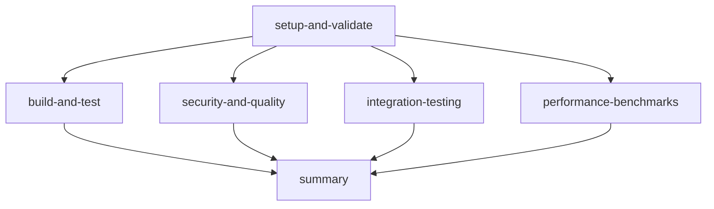

# Copilot Workflow Improvements

## Overview

The `.github/workflows/copilot-setup-steps.yml` workflow has been significantly enhanced to provide better performance, comprehensive tooling, and improved debugging capabilities for GitHub Copilot agents working with the git-ai repository.

## Key Improvements

### 1. Performance Optimizations

#### Multi-Level Caching Strategy
- **Rust Dependencies**: Enhanced `Swatinem/rust-cache@v2` with comprehensive caching
- **System Packages**: Cache APT packages and installed tools to avoid repeated downloads
- **Cargo Tools**: Cache installed cargo binaries across workflow runs
- **Build Artifacts**: Intelligent caching with monthly rotation for balance between freshness and speed

#### Parallel Job Execution
- Split workflow into 6 parallel jobs for faster execution:
  - `setup-and-validate`: Environment setup and tool installation
  - `build-and-test`: Parallel debug/release builds with comprehensive testing
  - `security-and-quality`: Security audits and code quality checks
  - `integration-testing`: End-to-end functional testing
  - `performance-benchmarks`: Build time and binary size tracking
  - `summary`: Consolidated reporting and artifacts

### 2. Enhanced Development Tools

#### Essential Cargo Tools
- `cargo-audit`: Security vulnerability scanning
- `cargo-outdated`: Dependency freshness checking
- `cargo-tree`: Dependency analysis and duplicate detection
- `cargo-watch`: File watcher for development
- `cargo-expand`: Macro expansion for debugging
- `cargo-llvm-cov`: Code coverage analysis
- `sccache`: Compilation cache for faster rebuilds
- `just`: Task runner integration

#### System Tools
- `fish`: Shell for running integration tests
- `jq`: JSON processing for workflow automation
- `tree`: Directory structure visualization
- `htop`: Process monitoring
- Network tools: `curl`, `wget`, `netcat-openbsd`
- Debugging tools: `strace`, `lsof`

### 3. Comprehensive Testing & Validation

#### Multi-Profile Builds
- Both debug and release builds tested in parallel
- Binary size and performance tracking
- Artifact generation for download and analysis

#### Quality Assurance
- `cargo clippy` with error-level warnings
- `cargo fmt` formatting validation
- Security audits with detailed reporting
- Dependency analysis and duplicate detection

#### Integration Testing
- Dry-run integration tests that don't require API keys
- Hook installation/uninstallation testing
- Configuration management validation
- Git operation compatibility checks

### 4. Advanced Monitoring & Reporting

#### Performance Benchmarking
- Build time measurement and tracking
- Binary size monitoring
- Performance regression detection
- Historical comparison capabilities

#### Comprehensive Artifacts
- Build binaries for both debug and release
- Performance reports with historical data
- Security audit results
- Test coverage reports

#### Enhanced Debugging
- Full backtrace support (`RUST_BACKTRACE=1`)
- Debug logging enabled (`RUST_LOG=debug`)
- Detailed error reporting with context
- Step-by-step execution visibility

### 5. Security Enhancements

#### Vulnerability Scanning
- Regular `cargo audit` security checks
- Dependency vulnerability reporting
- Automated security advisory integration

#### Safe API Key Handling
- No hardcoded API keys in workflow
- Dry-run testing without real credentials
- Secure environment variable patterns

## Usage for Copilot Agents

### Available Tools After Setup
When the workflow completes, agents have access to:

```bash
# Core git-ai functionality
git-ai --version                    # Version information
git-ai config                       # Configuration management
git-ai hook install/uninstall      # Git hook management

# Development tools
cargo clippy                        # Code quality analysis
cargo audit                         # Security vulnerability scanning
cargo tree --duplicates            # Dependency analysis
cargo outdated                      # Check for outdated dependencies
cargo expand                        # Macro expansion
just --list                         # Available tasks

# System tools
jq .                               # JSON processing
tree                               # Directory visualization
fish                               # Integration test shell
htop                               # Process monitoring
```

### Cached Artifacts
- Rust compilation cache (significantly faster rebuilds)
- System package cache (faster tool installation)
- Pre-built binaries available for download
- Performance baseline data

### Debugging Capabilities
- Full Rust backtrace support
- Debug logging enabled
- Comprehensive error context
- Performance profiling data

## Configuration

### Environment Variables
```yaml
GITHUB_TOKEN: ${{ secrets.GITHUB_TOKEN }}
CARGO_TERM_COLOR: always
RUST_BACKTRACE: 1
RUST_LOG: debug
```

### Cache Keys
- Monthly rotation for balance between performance and freshness
- Content-based hashing for invalidation when dependencies change
- Separate caches for different artifact types

### Job Dependencies


## Benefits for Agents

1. **Faster Development Cycles**: Comprehensive caching reduces setup time from minutes to seconds
2. **Better Debugging**: Enhanced error reporting and logging for faster problem resolution
3. **Comprehensive Tooling**: All necessary development tools pre-installed and cached
4. **Quality Assurance**: Automated security and quality checks catch issues early
5. **Performance Monitoring**: Track build performance and detect regressions
6. **Reliable Testing**: Comprehensive test suite validates changes thoroughly

## Migration Notes

The improved workflow is fully backward compatible with existing usage patterns while providing significant enhancements. No changes to existing git-ai functionality or usage are required.

## Future Enhancements

Potential future improvements could include:
- Cross-platform testing (macOS, Windows)
- Integration with external security scanning services
- Automated performance regression alerts
- Integration test coverage reporting
- Dependency license compliance checking