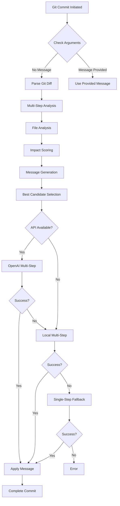

# Git AI Hook Commit Message Generation Process - Detailed Overview

## Table of Contents

1. [Introduction](#introduction)
2. [Architecture Overview](#architecture-overview)
3. [Process Flow](#process-flow)
4. [Phase-by-Phase Breakdown](#phase-by-phase-breakdown)
5. [Multi-Step Analysis System](#multi-step-analysis-system)
6. [Implementation Details](#implementation-details)
7. [Error Handling & Fallbacks](#error-handling--fallbacks)
8. [Performance Optimization](#performance-optimization)
9. [Configuration & Customization](#configuration--customization)

## Introduction

Git AI is a sophisticated Rust-based CLI tool that automates the generation of high-quality commit messages by analyzing git diffs through a structured, multi-phase process. The system seamlessly integrates with git hooks to intercept the commit process and generate contextually relevant commit messages using AI.

## Architecture Overview

The system consists of several key components:

```
┌─────────────────┐     ┌──────────────────┐     ┌─────────────────┐
│   Git Command   │────▶│  Git AI Hook     │────▶│  Multi-Step     │
│  (git commit)   │     │ (prepare-commit) │     │   Processor     │
└─────────────────┘     └──────────────────┘     └─────────────────┘
                                │                          │
                                ▼                          ▼
                        ┌──────────────────┐     ┌─────────────────┐
                        │   Diff Parser    │     │   AI Analysis   │
                        │   & Processor    │     │   (OpenAI/Local)│
                        └──────────────────┘     └─────────────────┘
```

### Core Components

1. **CLI Interface** (`src/main.rs`)

   - Command-line interface for configuration and hook management
   - Handles installation, uninstallation, and configuration commands

2. **Git Hook Binary** (`src/bin/hook.rs`)

   - Actual git hook executable invoked during commit process
   - Manages the prepare-commit-msg hook lifecycle

3. **Multi-Step Integration** (`src/multi_step_integration.rs`)

   - Orchestrates the multi-phase commit message generation
   - Coordinates between different analysis steps

4. **Multi-Step Analysis** (`src/multi_step_analysis.rs`)

   - Implements file categorization and impact scoring
   - Generates commit message candidates

5. **Function Calling** (`src/function_calling.rs`)
   - Implements OpenAI function calling for structured output
   - Ensures consistent response format

## Process Flow



## Phase-by-Phase Breakdown

### Phase 1: Initialization & Setup

When `git commit` is executed without a message:

1. **Hook Invocation**

   ```rust
   // src/bin/hook.rs
   struct Args {
       commit_msg_file: PathBuf,  // .git/COMMIT_EDITMSG
       source: Option<Source>,     // message, template, merge, squash, commit
       sha1: Option<String>        // HEAD or specific commit SHA
   }
   ```

2. **Environment Setup**

   - Parse command-line arguments
   - Initialize logging and profiling
   - Load configuration from `~/.config/git-ai/config.toml`
   - Validate OpenAI API key availability

3. **Repository Context**
   - Open git repository from current directory
   - Determine commit type (new, amend, merge, etc.)
   - Check for existing commit messages

### Phase 2: Git Diff Analysis

The system generates and processes the git diff:

```rust
// src/hook.rs
impl PatchRepository for Repository {
    fn to_commit_diff(&self, tree: Option<Tree<'_>>) -> Result<git2::Diff<'_>> {
        // Get diff between tree and index (staged changes only)
        match tree {
            Some(tree) => self.diff_tree_to_index(Some(&tree), None, Some(&mut opts)),
            None => {
                // If no HEAD, compare against empty tree
                let empty_tree = self.find_tree(self.treebuilder(None)?.write()?)?;
                self.diff_tree_to_index(Some(&empty_tree), None, Some(&mut opts))
            }
        }
    }
}
```

**Diff Processing Features:**

- Parallel processing for large diffs
- Token counting and management
- Memory pooling for efficiency
- Chunk-based processing (25 files per chunk)

### Phase 3: AI Processing Strategy

The system employs a sophisticated multi-step approach:

#### Primary Attempt - Multi-Step Approach

```rust
// src/multi_step_integration.rs
pub async fn generate_commit_message_multi_step(
    client: &Client<OpenAIConfig>,
    model: &str,
    diff_content: &str,
    max_length: Option<usize>
) -> Result<String> {
    // Step 1: Parse diff into individual files
    let parsed_files = parse_diff(diff_content)?;

    // Step 2: Analyze each file
    let file_analyses = /* ... */;

    // Step 3: Calculate impact scores
    let scored_files = call_score_function(/* ... */)?;

    // Step 4: Generate candidates
    let candidates = call_generate_function(/* ... */)?;

    // Step 5: Select best candidate
    let final_message = select_best_candidate(/* ... */)?;

    Ok(final_message)
}
```

#### Fallback - Single-Step Approach

If multi-step fails, the system falls back to a simpler approach using function calling.

### Phase 4: Commit Message Generation

The generation process follows these principles:

1. **Analyze Functional Significance**

   - Identify primary changes
   - Determine change impact
   - Group related modifications

2. **Generate Reasoning**

   - Explain why changes were made
   - Justify message selection
   - Document decision process

3. **Create Message**
   - Follow conventional commit format
   - Stay within character limits (default: 72)
   - Focus on most impactful changes

### Phase 5: File-Level Analysis

For each modified file, the system performs:

```rust
// src/multi_step_analysis.rs
pub fn analyze_file(file_path: &str, diff_content: &str, operation_type: &str) -> FileAnalysisResult {
    // Count lines added/removed
    let mut lines_added = 0u32;
    let mut lines_removed = 0u32;

    for line in diff_content.lines() {
        if line.starts_with('+') && !line.starts_with("+++") {
            lines_added += 1;
        } else if line.starts_with('-') && !line.starts_with("---") {
            lines_removed += 1;
        }
    }

    // Categorize file
    let file_category = categorize_file(file_path);

    // Generate summary
    let summary = generate_file_summary(file_path, diff_content, operation_type);

    FileAnalysisResult {
        lines_added,
        lines_removed,
        file_category,
        summary
    }
}
```

**File Categories:**

- `source`: Core application code (weight: 1.0)
- `test`: Test files (weight: 0.6)
- `config`: Configuration files (weight: 0.8)
- `docs`: Documentation (weight: 0.4)
- `binary`: Binary files (weight: 0.1)
- `build`: Build/dependency files (weight: 0.7)

### Phase 6: Statistical Analysis

Impact scoring algorithm:

```rust
fn calculate_single_impact_score(file_data: &FileDataForScoring) -> f32 {
    let mut score = 0.0f32;

    // Base score from operation type
    score += match file_data.operation_type.as_str() {
        "added" => 0.3,
        "modified" => 0.2,
        "deleted" => 0.25,
        "renamed" => 0.1,
        "binary" => 0.05,
        _ => 0.1
    };

    // Score from file category
    score += match file_data.file_category.as_str() {
        "source" => 0.4,
        "test" => 0.2,
        "config" => 0.25,
        "build" => 0.3,
        "docs" => 0.1,
        "binary" => 0.05,
        _ => 0.1
    };

    // Score from lines changed (normalized)
    let total_lines = file_data.lines_added + file_data.lines_removed;
    let line_score = (total_lines as f32 / 100.0).min(0.3);
    score += line_score;

    score.min(1.0) // Cap at 1.0
}
```

### Phase 7: Performance Monitoring

The system includes comprehensive profiling:

```rust
// src/profiling.rs
macro_rules! profile {
    ($name:expr) => {
        let _guard = $crate::profiling::ProfileGuard::new($name);
    };
}
```

**Tracked Metrics:**

- Total execution time
- API request/response duration
- Diff parsing time
- Token counting overhead
- File analysis duration

### Phase 8: Final Commit Execution

Once the message is generated:

1. Write message to commit file
2. Clear progress indicators
3. Log performance metrics
4. Return control to git

## Multi-Step Analysis System

The multi-step system provides several advantages:

### 1. Divide and Conquer Strategy

Instead of processing the entire diff at once, the system:

- Parses individual files
- Analyzes each independently
- Aggregates results intelligently

### 2. Specialized Function Tools

Three specialized OpenAI function tools:

```rust
// Analyze Function
create_analyze_function_tool() // Examines individual files

// Score Function
create_score_function_tool()   // Calculates impact scores

// Generate Function
create_generate_function_tool() // Creates message candidates
```

### 3. Candidate Generation

Multiple message styles are generated:

```rust
// Action-focused: "Update authentication logic"
// Component-focused: "auth: improve validation"
// Impact-focused: "New feature for user authentication"
```

## Error Handling & Fallbacks

The system implements a robust fallback strategy:

```
Multi-Step OpenAI → Local Multi-Step → Single-Step OpenAI → Error
```

### Fallback Triggers

1. **API Failures**

   - Network timeouts
   - Rate limiting
   - Invalid responses

2. **Token Limits**

   - Diff too large
   - Context overflow
   - Model constraints

3. **Parsing Errors**
   - Malformed diffs
   - Binary files
   - Encoding issues

## Performance Optimization

### 1. Parallel Processing

```rust
// Process files in parallel chunks
const PARALLEL_CHUNK_SIZE: usize = 25;

files.par_chunks(PARALLEL_CHUNK_SIZE)
    .map(|chunk| process_chunk(chunk))
    .collect()
```

### 2. Memory Management

```rust
struct StringPool {
    strings: Vec<String>,
    capacity: usize
}

// Reuse string allocations
let mut pool = StringPool::new(DEFAULT_STRING_CAPACITY);
```

### 3. Token Optimization

- Pre-calculate instruction tokens
- Truncate diffs intelligently
- Prioritize high-impact changes

## Configuration & Customization

### Configuration File

Location: `~/.config/git-ai/config.toml`

```toml
model = "gpt-4o-mini"
max_tokens = 4096
max_commit_length = 72
openai_api_key = "sk-..."
timeout = 30
```

### Environment Variables

```bash
OPENAI_API_KEY=sk-...     # API key
RUST_LOG=debug            # Enable debug logging
GIT_AI_MODEL=gpt-4        # Override model
```

### CLI Configuration

```bash
# Set model
git-ai config set model gpt-4o-mini

# Set max commit length
git-ai config set max-commit-length 100

# Set API key
git-ai config set openai-api-key sk-...

# Reset to defaults
git-ai config reset
```

## Key Features Summary

1. **Intelligent Fallback System**

   - Multi-step → Local → Single-step
   - Ensures commits always succeed

2. **Impact-Based Prioritization**

   - Focuses on functionally significant changes
   - Weights files by category and size

3. **Comprehensive Logging**

   - Debug output with timing
   - Structured information display
   - Performance metrics

4. **Token Management**

   - Careful limit handling
   - Intelligent truncation
   - Model-aware processing

5. **Error Resilience**
   - Graceful degradation
   - Multiple retry strategies
   - Clear error messages

## Expected Outputs

### Commit Message Format

```
<type>: <description>

<optional body>
<optional footer>
```

### Example Output

```
feat: Add JWT authentication system

- Implement JWT token generation and validation
- Add middleware for protected routes
- Include comprehensive error handling
- Update package.json with new dependencies

Files changed: 5 (4 source, 1 build)
Impact score: 0.95 (high priority changes)
```

### Debug Output

```
[DEBUG] Starting multi-step commit message generation
[DEBUG] Parsed 5 files from diff
[DEBUG] Analyzing file: src/auth/jwt.rs
[DEBUG] File analysis complete: +89 -0 lines, category: source
[DEBUG] Calculating impact scores for 5 files
[DEBUG] Generated 3 commit message candidates
[DEBUG] Selected best candidate based on impact analysis
[DEBUG] Total execution time: 1.23s
```

## Conclusion

The Git AI hook system represents a sophisticated approach to automated commit message generation. By combining multi-step analysis, intelligent fallbacks, and comprehensive error handling, it ensures developers always get meaningful commit messages that accurately represent their changes while maintaining high performance and reliability.
